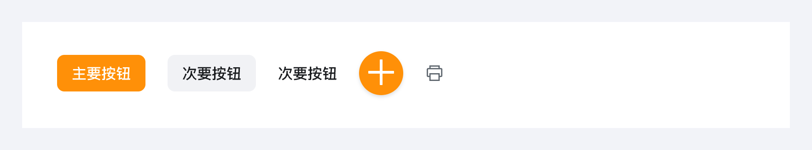
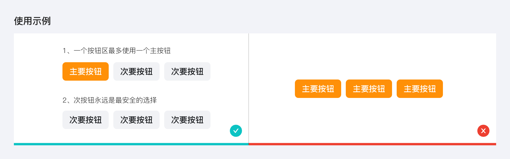
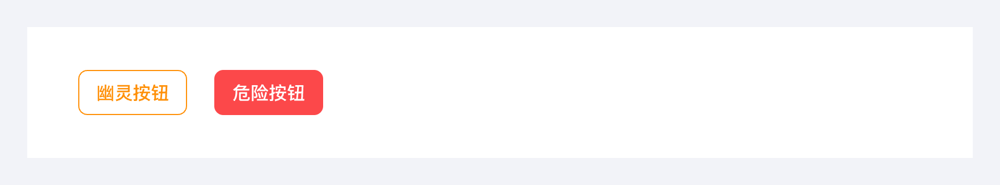
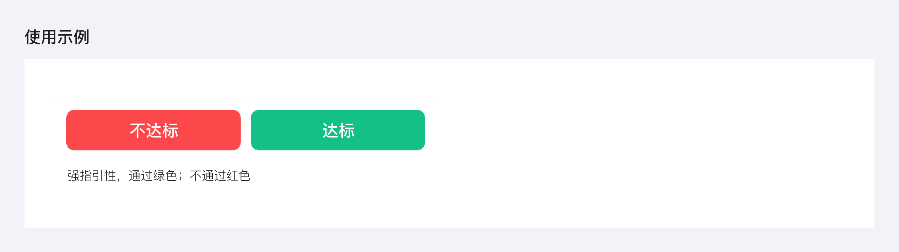
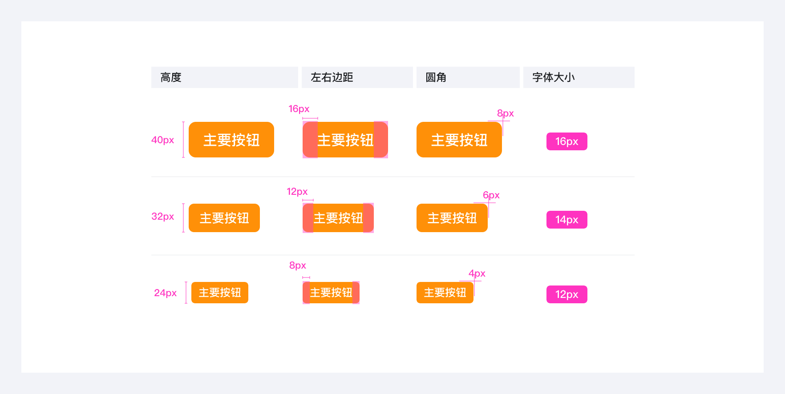
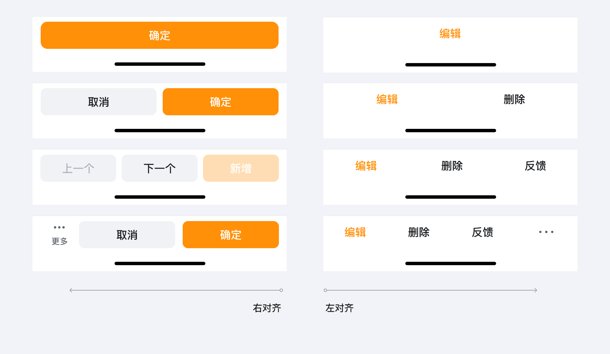
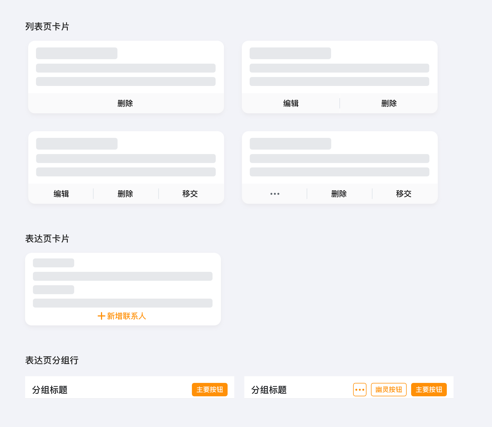

---
group:
  title: 基础组件
  order: 3
order: 1
title: 按钮
toc: content
---

# 按钮

按钮是一种命令组件，可发起一个即时操作。

## 按钮类型

- 主按钮 ：突出“完成”、“推荐”类操作；一个按钮区最多使用一个主按钮。
- 次按钮：常规按钮，用于非主要动作。如果不确定选择哪种按钮，次按钮永远是最安全的选择。
- 文字按钮 ：弱化的按钮，采用更轻量的按钮样式，可用于需大面积展示按钮场景，例如卡片内操作
- 悬浮按钮 ：通常为核心/全局性操作，位于列表页右下角
- 图标按钮：图标提供视觉线索，避免逐字阅读按钮文案。使用纯图标按钮必须有 Tooltip 提示按钮含义。

## 特殊按钮

特殊按钮： 幽灵按钮、危险按钮

- 幽灵按钮 ：非核心操作，视觉优先的设计语言。使用频率远低于次要按钮
- 危险按钮：通过强烈的视觉警示用户，明确的意图性

## 按钮尺寸

分为常规中按钮、大按钮、小按钮

## 按钮使用规范

### 底部按钮顺序

推荐使用带背景按钮，apaas 页面使用文字按钮

### 按钮组合类型

