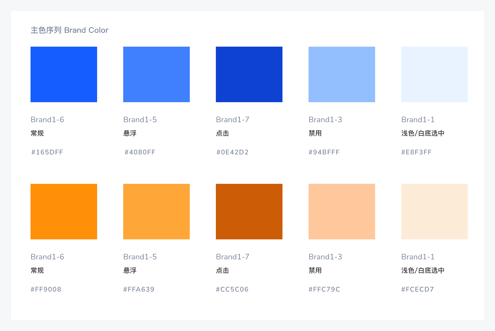
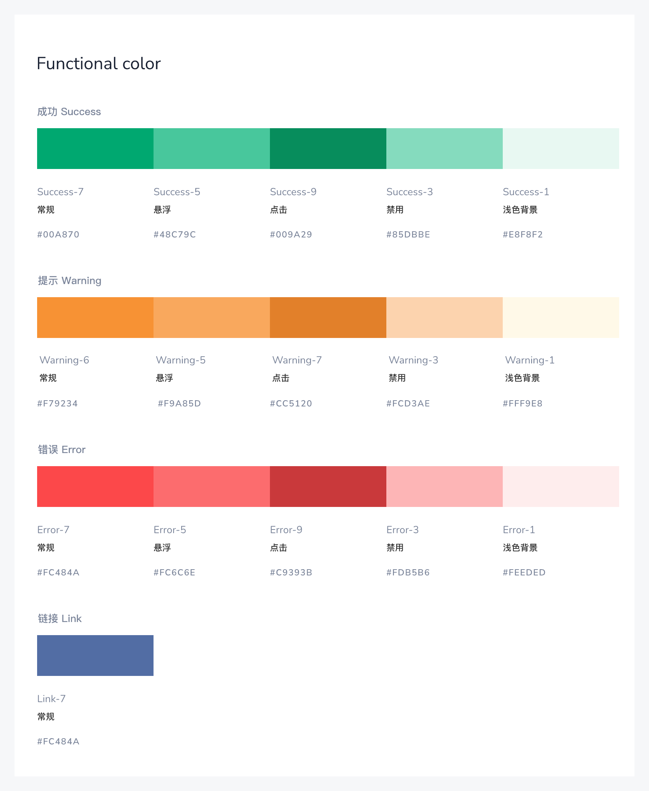
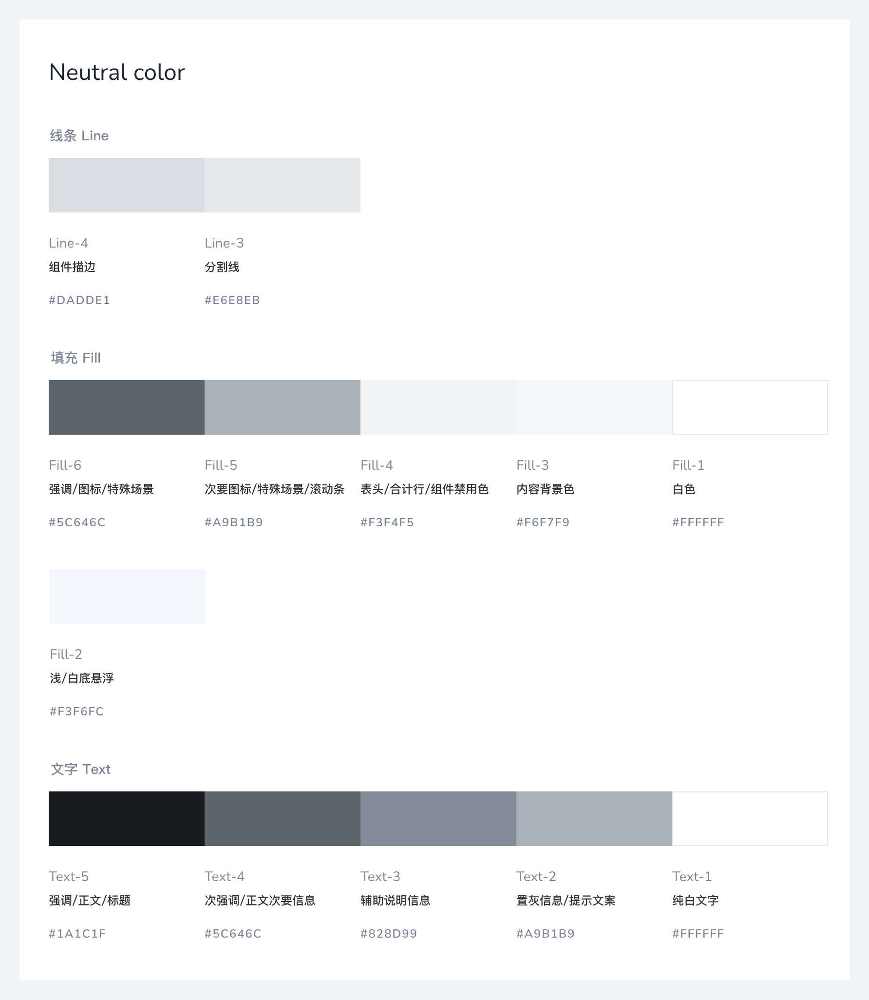
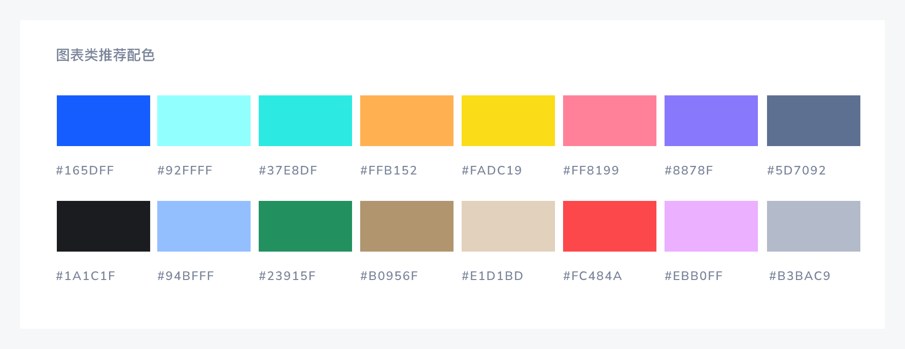
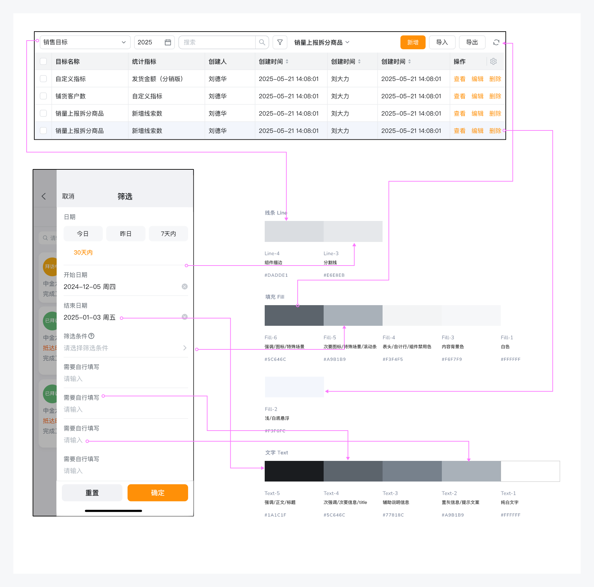

---
group:
  title: 全局样式
  order: 2
title: 色彩
order: 1
toc: content
---

# 色彩

色彩对产品的视觉传达和多维度信息的承载有着很重要的影响，好的产品在色彩配置上应当清晰，准确的传达有效信息和品牌感。按照颜色类型和功能的不同，勤策 Design 将色彩分为主色、功能色、中性色、遮罩色、分类色。

### 主色

主色是一个产品的代表颜色，一般与品牌色相关联。常用于主要按钮和文字、重点操作状态、高亮提醒、空状态等。勤策的默认主色为#FF9008，同时根据使用场景的不同，基于主色衍生出了点击态、悬浮态等不同状态下的颜色。勤策可自定义主题色。

### 功能色

功能色的主要作用是向用户明确的传达成功、警告、错误、链接等信息和状态。arco 基于用户对色彩的通用认知，提供了适合不同状态的功能色及其配套色板。

### 中性色

中性色包含了黑、白、灰。常用于文字、线、背景填充等场景，勤策 design 的中性色包含了从白到黑色 12 个颜色。合理地选择中性色能够令页面信息具备良好的主次关系，助力用户体验。

### 遮罩色

遮罩色常用于作为底色突出模态窗口，一般以黑色、白色为基色，配合透明度百分比使用。

### 分类色

为满足 UI 界面配色需求，我们提供基础的 8 色、16 色、24 色组合规范，可用于界面图表、图标、图形、列表等元素中。

### 使用案例

