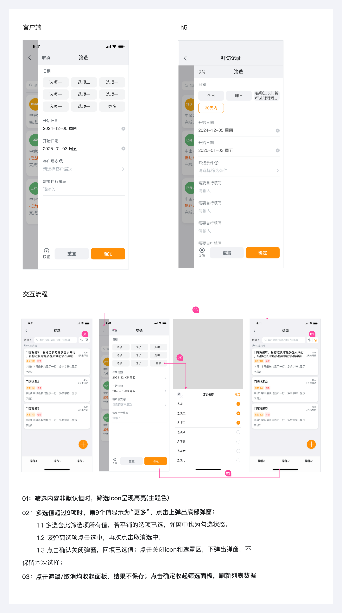
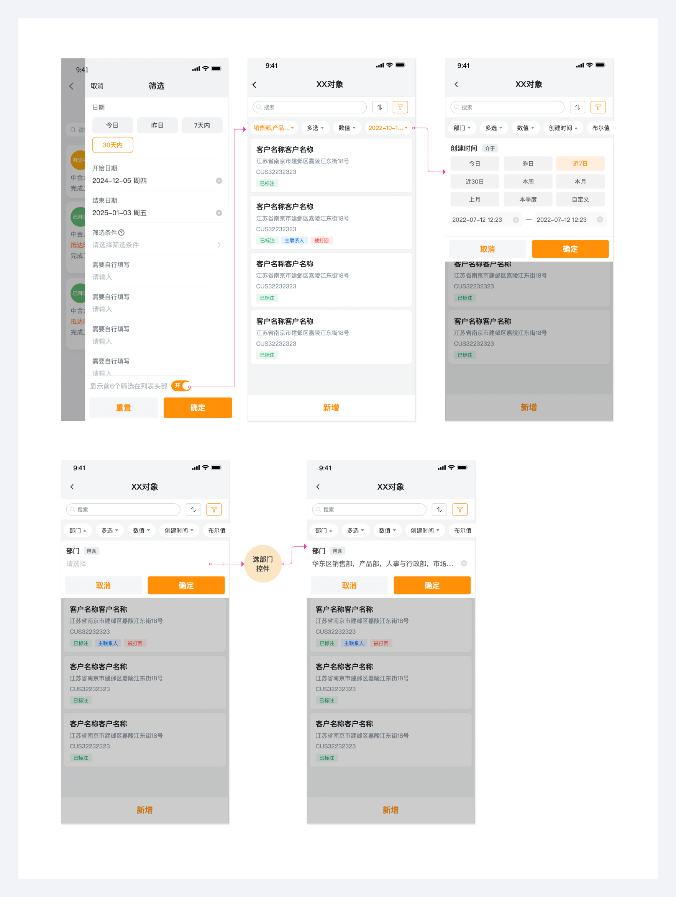

---
group:
  title: 基础组件
  order: 3
order: 7
title: 筛选
toc: content
---

# 筛选

目的是帮助用户更高效、更精准地定位目标内容，快速完成交互动作

位置：常位于列表/网格顶部或底部导航栏附近，自右往左弹出

## 筛选交互流程

页面占比 85%，其他部分覆盖 40%透明度的半遮罩层；

## 外露筛选(建设中)

外露筛选值，操作更便利，后期将逐步优化推广

