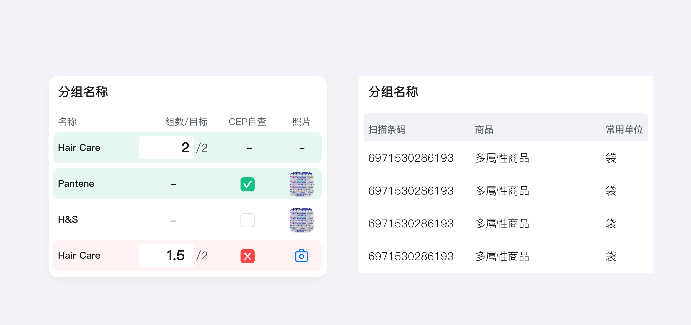

---
group:
  title: 基础组件
  order: 3
order: 5
title: 表单
toc: content
---

# 表单

表单填写页是用户输入信息的核心场景，标题与输入内容的布局结构直接影响用户的填写效率及空间利用率，我们通常会使用上下结构或左右结构，当然也从我们铺货的业务场景中总结出了列表结构。

## 垂直卡片式 

- 上下结构：拓展性较强，字段标题可展示更多字符，适合国际化；
- 有测试表明上下结构表单填写速度比左右快 1.5 倍，错误率降低 30%（与人的视觉动线相关）；

## 水平卡片式 

标题及内容统一做对齐(适合 F 型阅读模式)，标题最多显示 6 字...

## 列表式

适合上报类场景，提高屏效及工作效率

