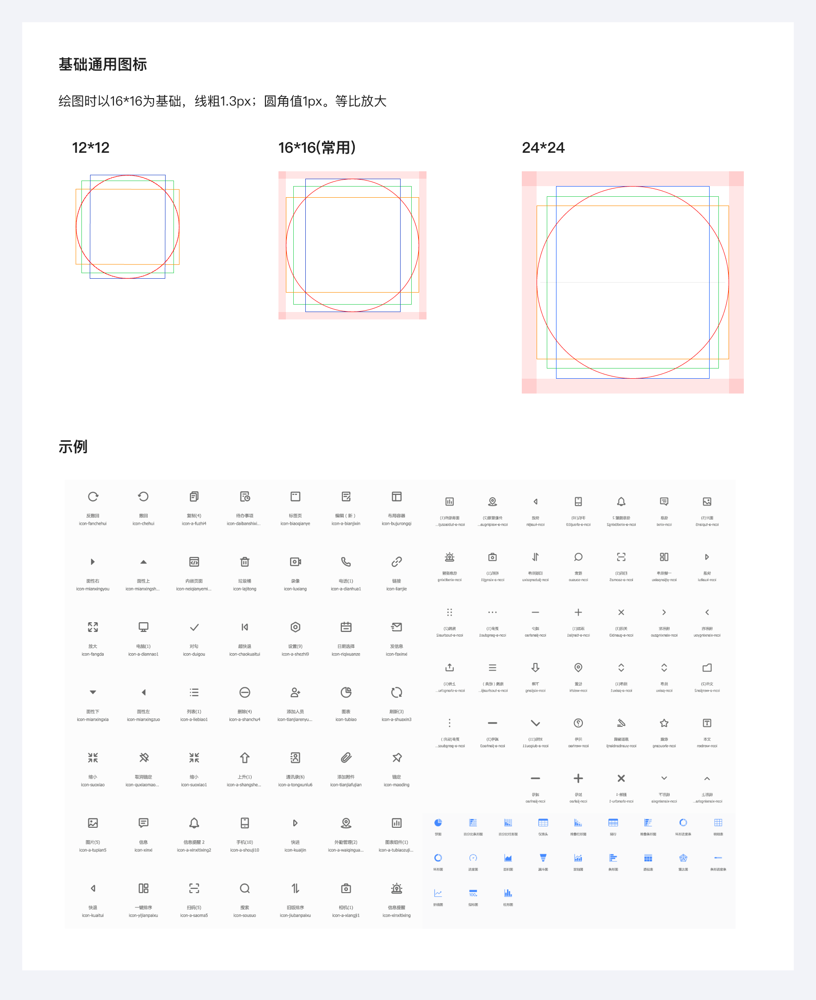
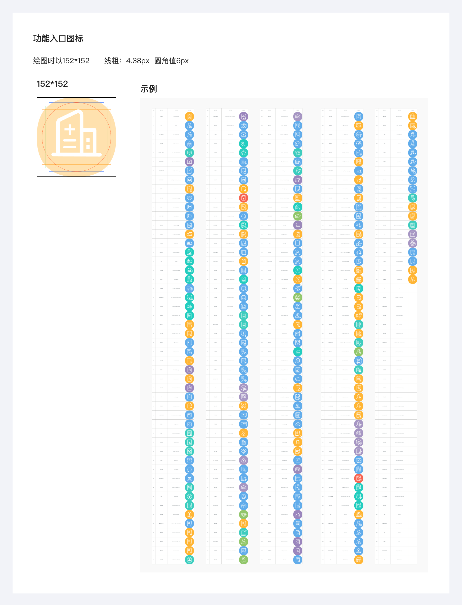

# 图标

- 推荐使用矢量图（SVG / iconfont），保证清晰度和灵活性；交付方式：上传至[图标库](https://www.iconfont.cn/manage/index?spm=a313x.manage_index.i1.db775f1f3.39243a81XFC76q&manage_type=myprojects&projectId=1554087)

- 图标分类：线性、面性、扁平、渐变、3D、质感，交付方式：@3x 切图

### 图标设计原则

- 基础通用图标：16\*16 &nbsp;&nbsp; 线粗 1.3px &nbsp;&nbsp;圆角值 1px

- 功能入口图标：152\*152 &nbsp;&nbsp; 线粗：4.38px &nbsp;&nbsp;圆角值 6px

