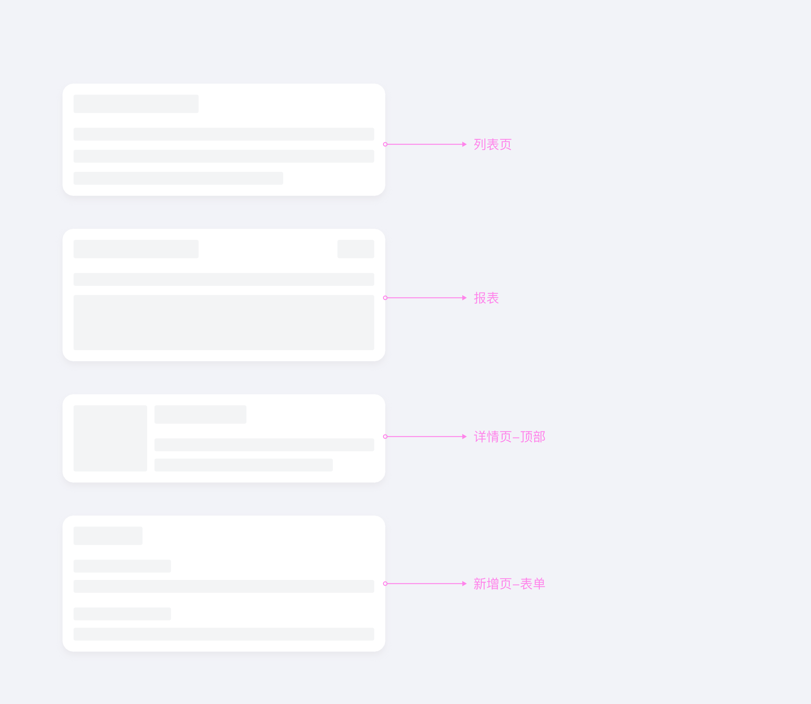
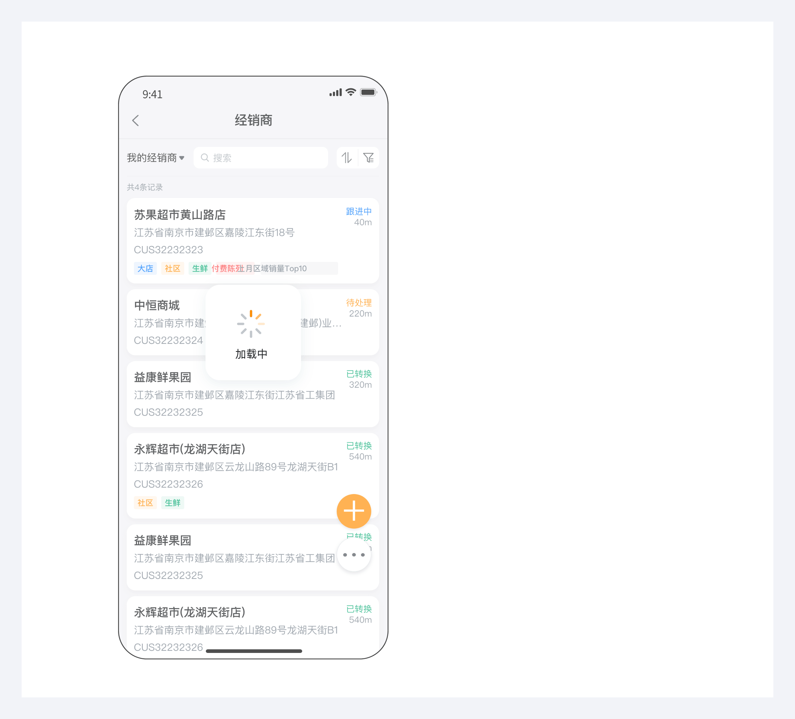
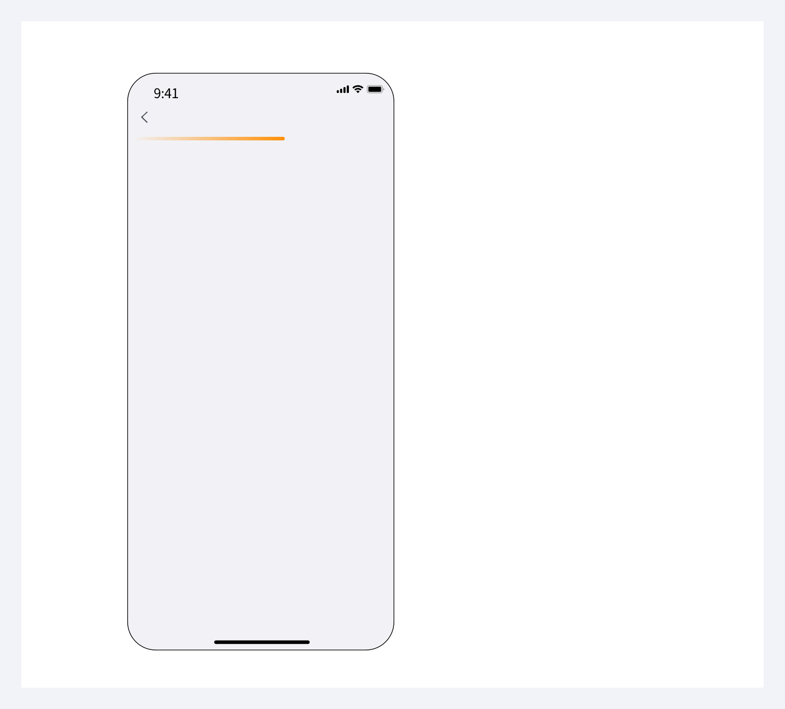
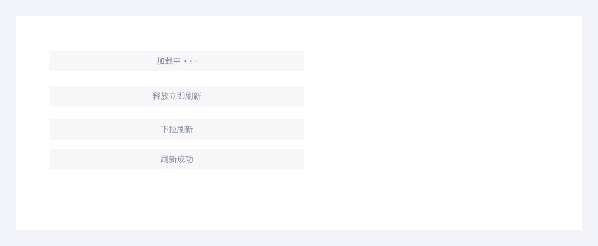
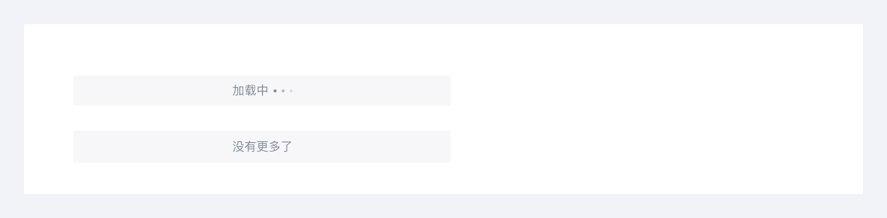

---
group:
  title: 基础组件
  order: 3
order: 8
title: 交互模式
toc: content
---

# 交互模式

骨架屏、加载进度、加载进度

## 骨架屏

骨架屏是一种轻量化的页面加载方案，在数据尚未完全渲染时，用灰色轮廓框架提前展示页面布局结构，替代传统的 “Loading” 加载动画。其本质是通过预判页面结构，提升用户对加载过程的感知体验。

## 传统 “Loading” 加载动画

## 客户端跳转 h5 页面

## 下拉刷新

## 页脚

## 空状态

