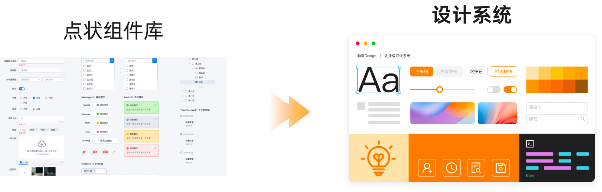

---
nav:
  title: 设计
  order: -1
group:
  title: 设计
  order: 1
title: 介绍
order: 1
toc: content
---

# 勤策 Design

<!-- 

  

 -->

勤策 Design 是由 UED 部门推出的企业级产品设计系统，旨在帮助设计师与开发者解放双手、提升工作效率，创造务实友好的产品。

我们的目标是通过通用的设计系统去解决产品中的体验问题, 并为产品设计提供指导原则解决业务问题，同时它能够促进设计部门和研发部门之间协作, 成为开发者之间沟通的语言。

我们结合过往项目中的最佳实践，基于「清晰」、「高效」、「友好」、「一致」的价值观，创造了勤策 Design 设计系统。

