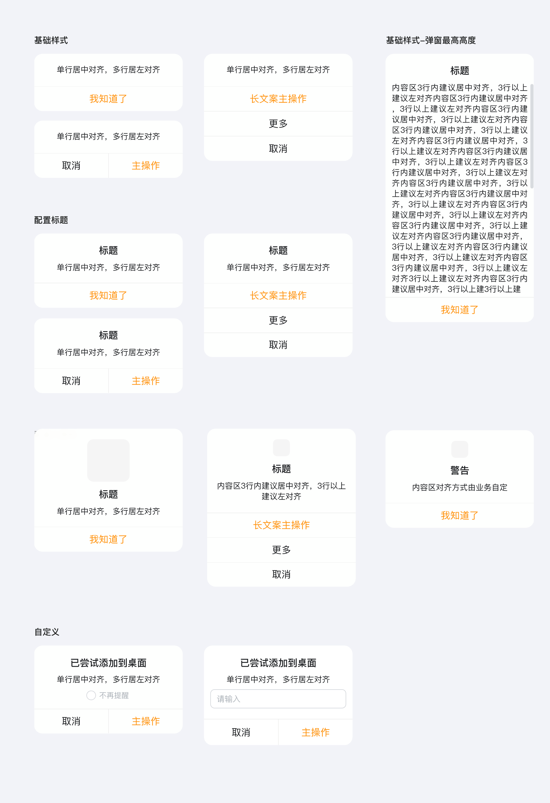
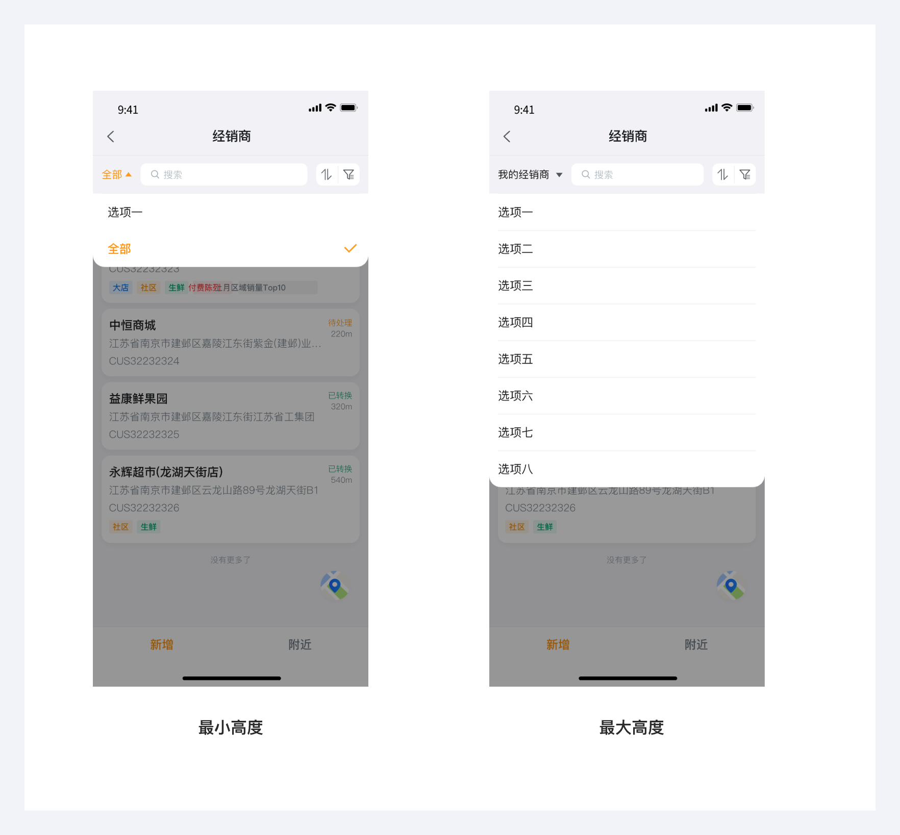
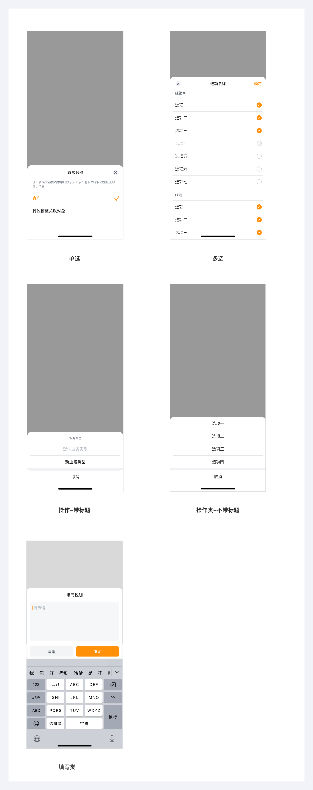

---
group:
  title: 基础组件
  order: 3
order: 6
title: 模态弹窗
toc: content
---

# 模态弹窗

模态弹窗在用户界面中起到了引导操作、传递关键信息的作用；但会中断用户当前操作流程

注意事项：在设计时避免滥用：过度使用模态弹窗会打断用户流程，降低体验。

## 基础样式

- 弹窗自适应高度、宽度固定；
- 宽度：280px(375px)，屏幕宽度的 75%
- 高度：506px(724px)，屏幕宽度的 70%

## 下拉弹窗

通常以 “从顶部下拉展开” 的形式呈现，其核心优势是轻量化交互，不会完全阻断主流程的场景。

## 底部弹窗

通常以 “从顶部下拉展开” 的形式呈现，其核心优势是轻量化交互，不会完全阻断主流程的场景。

