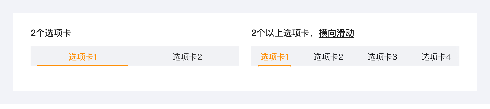
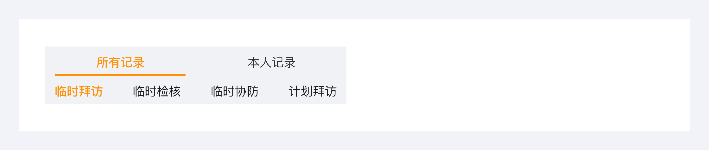
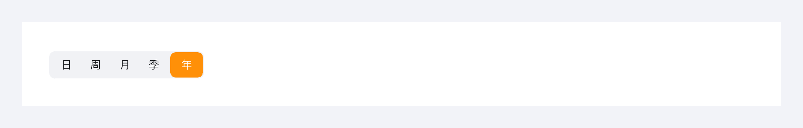
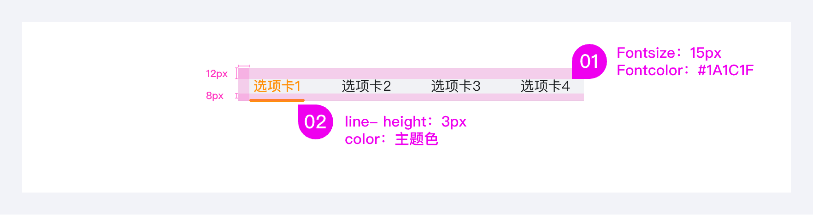

---
group:
  title: 基础组件
  order: 3
order: 2
title: 标签页
toc: content
---

# 标签页

标签页把大量信息进行分类展示，用户可以方便地切换标签，而不必跳转页面进行比较浏览，可以在有限的显示区域内展示更多信息。分类可根据业务类别、业务状态或者操作类型等并列关系来分，分类标题长度为 2-6 个中文字。标签页常用于页头区

## 组件分类及使用场景

常规 tabs：1 个维度的切换，简短的文字描述（必要时可附带图标）建议每个标签不超过 4 个汉字，一次展示不超过 7 个标签；

两个维度切换，提供不同的组合样式

带徽标/数字

胶囊型样式：用于卡片内的选项切换，经常和其它组件结合使用，让用户快速切换对应内容。

## 设计 tips 

1. 两个选项卡，选中线延长对页面进行均分；
2. 多个选项卡，选中线与文字对齐；
3. 单个切换不显示

## 组件尺寸

常规 tabs

