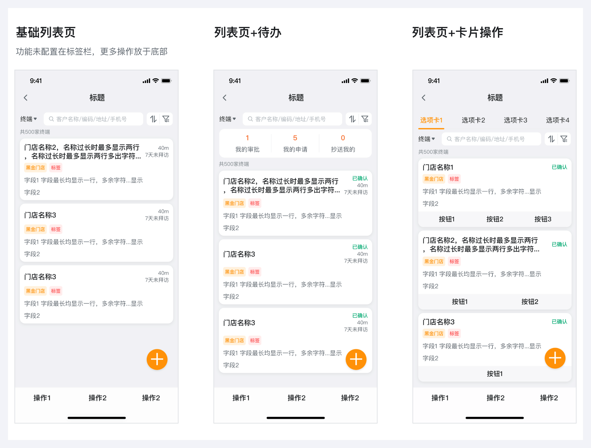
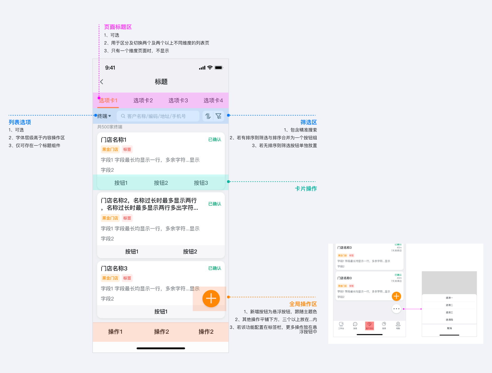
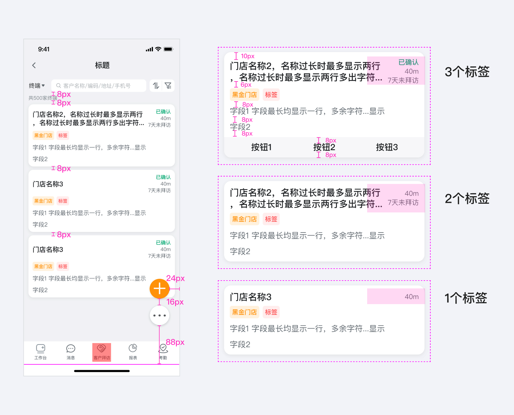
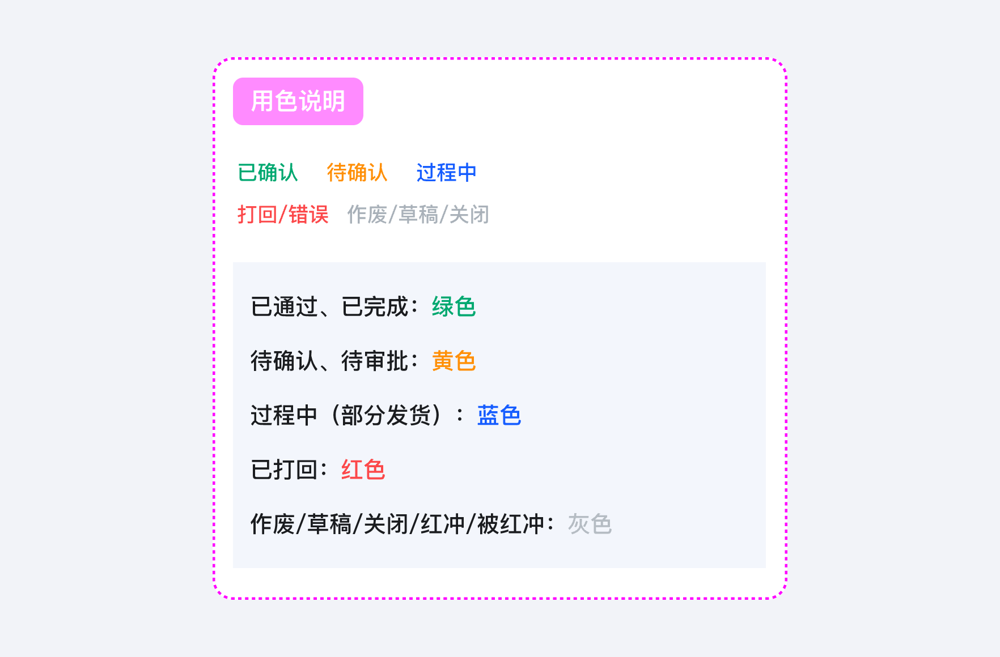

---
group:
  title: 典型页面
  order: 5
order: 1
title: 列表
toc: content
---

# 操作列表页

用户可在列表页对条目进行筛选、对比、新增、分析、下钻至条目完整详情页等操作。

## 设计目标

帮助用户更高效的查看、处理数据。

## 使用场景

1. 数据过滤----易查找

2. 数据操作----易操作：增删改。包括全局操作和单行操作

3. 数据查看----易浏览、对比

## 如何设计

### 操作列表构成

1. 页面标题：用于区分及切换两个及两个以上不同维度的列表页，只有一个维度的页面时，不显示标题。
2. 列表全局筛选区：排列顺序下拉筛选、精准搜索、排序、全局筛选。
3. 卡片区域：包含主要信息、次要信息，提示信息/状态与标题一行。主要信息最多展示2行...次要信息最多展示一行...

### 表格规范

### 标签状态说明

