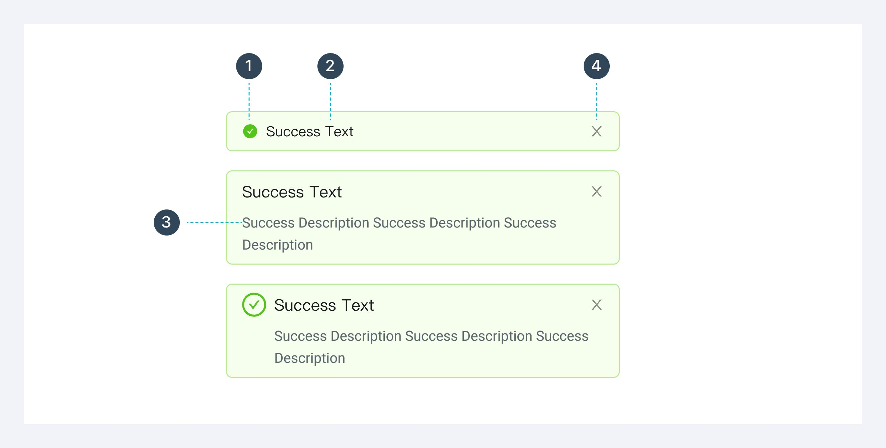
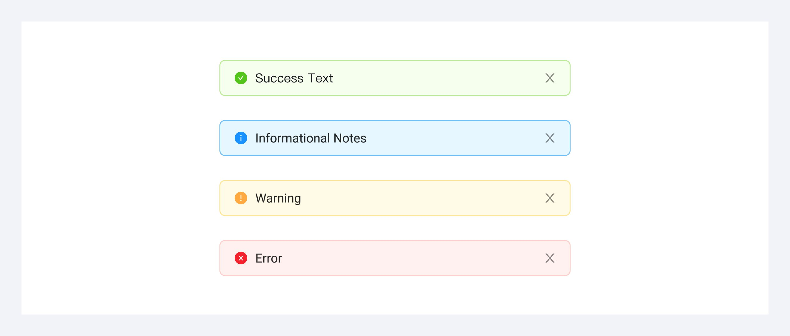
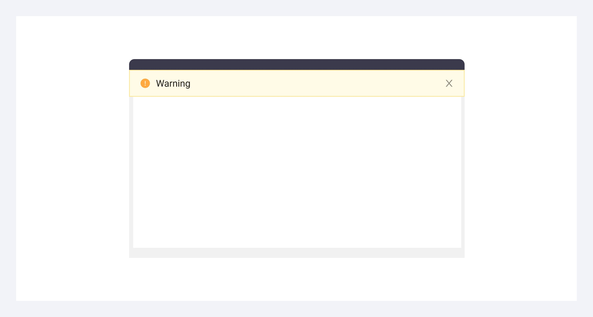

---
group:
  title: 组件用法
  order: 4
order: 9
title: 警告
toc: content
---

# 警告 Alert

是一种非阻碍式的信息展示，它不打断用户的当前操作，一般停留至页面某个位置（优先顶部），非浮层的静态展现形式，始终展现，不会自动消失，用户可以点击关闭。

## 组件构成

图标（可选）、2. 标题、3. 文本描（可选）、4. 关闭按钮（可选）

## 组件类型

成功、提示、警示、错误

## 组件位置

位于页面/卡片等容器的顶部

