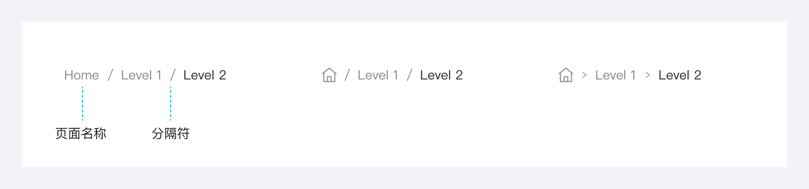
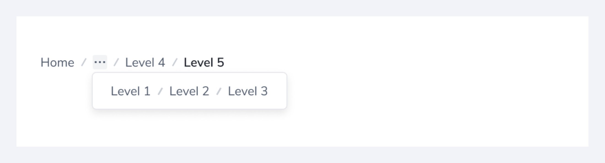

---
group:
  title: 组件用法
  order: 4
order: 4
title: 面包屑
toc: content
---

# 面包屑

面包屑是辅助导航模式，用于识别页面在层次结构内的位置，并根据需要向上返回。

## 组件构成

面包屑组件由文字标签、分隔符组成。

## 组件尺寸

可根据实际业务中定义面包屑的尺寸。常见的有 14px、12px 两种尺寸。

## 省略菜单

当空间有限时（例如出现五级以上的面包屑），使用省略菜单来截断面包屑。通常显示首页与两个页面标签，其余面包屑被收起在省略菜单中。

## 使用场景

面包屑位于页面或模块的左上角，同时应位于页面中的主要导航或标题之下。

