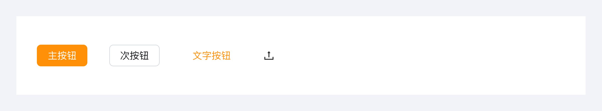
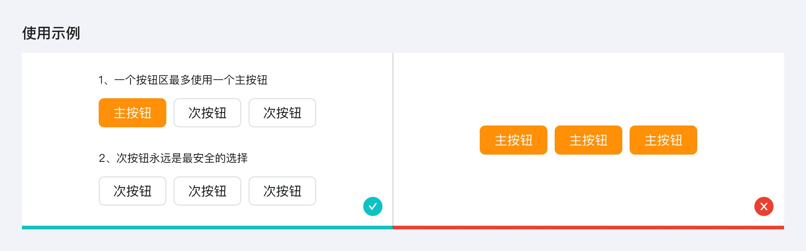
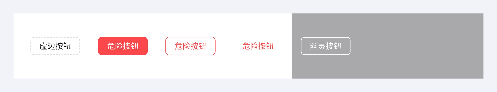
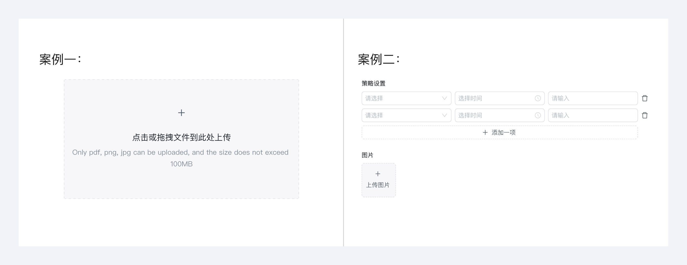
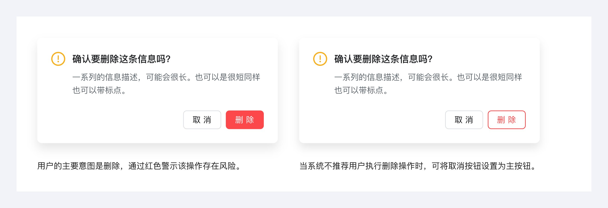
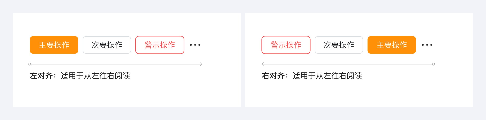
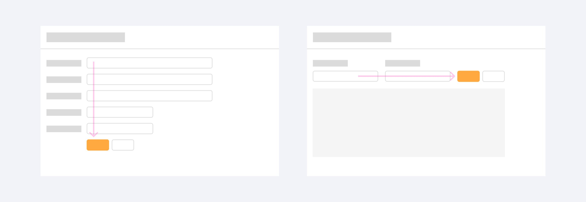
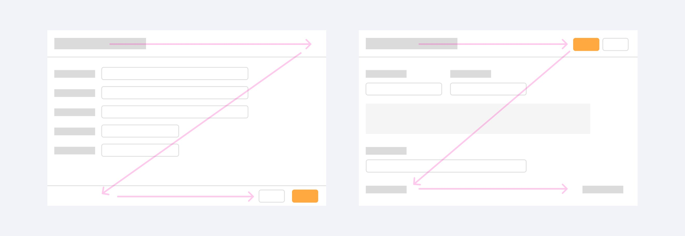

---
group:
  title: 组件用法
  order: 4
order: 1
title: 按钮
toc: content
---

# 按钮

按钮是一种命令组件，可发起一个即时操作。

## 常规按钮

按钮分为 主按钮、次按钮、文字按钮、图标按钮

- 主按钮 ：突出“完成”、“推荐”类操作；一个按钮区最多使用一个主按钮。
- 次按钮：常规按钮，用于非主要动作。如果不确定选择哪种按钮，次按钮永远是最安全的选择。
- 字按钮 ：弱化的按钮，采用更轻量的按钮样式，可用于需大面积展示按钮场景，例如表格组件中的操作列
- 图标按钮：图标提供视觉线索，避免逐字阅读按钮文案。使用纯图标按钮必须有 Tooltip 提示按钮含义。

## 特殊按钮

特殊按钮有 虚边按钮、危险按钮、幽灵按钮

虚边按钮：用于引导用户在一个区域中添加内容。

危险按钮：警示用户该操作存在风险。

## 按钮顺序

推荐操作是阅读的起点，折叠内容始终在最右侧。

## 按钮位置

常规页面可抽象归纳为三个区域：头部区域、内容区域、页脚区域。不同区域的按钮具有不同的动作含义，见下图

内容区：按钮跟随内容

头部/页脚区：按钮靠右放置

