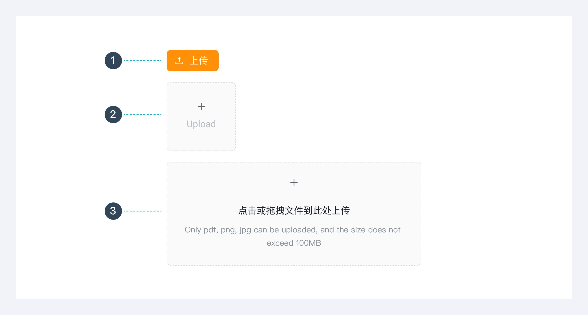
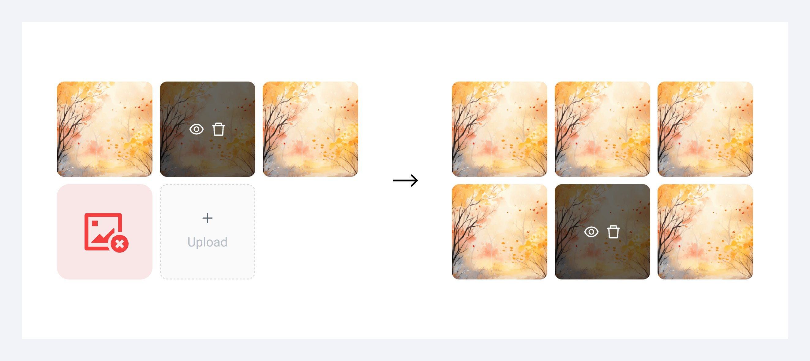

---
group:
  title: 组件用法
  order: 4
order: 17
title: 文件上传
toc: content
---

# 文件上传

## 组件类型

根据上传的交互方式分类：基础样式、图片上传、拖拽上传

## 上传后显示样式：文本样式、图片列表样式、图片墙样式

上传过程状态： 上传成功、上传失败、上传中

## 限制上传数量

当上传文件满足最大数量时，隐藏上传入口

