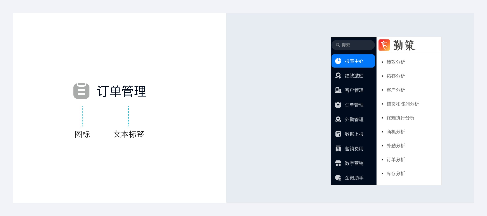

---
group:
  title: 组件用法
  order: 4
order: 3
title: 导航菜单
toc: content
---

# 导航菜单

菜单是系统主要的导航形式，用户可以通过菜单访问目标功能。

## 组件构成

文本标签 + 图标（可选）

## 组件尺寸

可根据实际业务中文本标签的长度来定义侧边导航的宽度。常见的有 200PX、220PX、240PX、260PX。

## 组件类型及使用场景

| 组件类型 | 图例 | 使用说明 |
|----------|------|----------|
| 顶部导航菜单 |  | 系统层级简单且功能数量少时，可使用顶部导航菜单进行“上下布局”。该整体视觉动线简单，适合信息展示类系统 |
| 侧边栏导航菜单 |  | 系统层级简单但功能数量多时，可使用侧边导航菜单进行“左右布局”。竖向排列的形式可以展示更多的菜单项 |
| 顶导航菜单&侧导航菜单 |  | 系统层级较复杂且功能量多时，可使用侧边导航菜单进行“左右布局”。竖向排列的形式可以展示更多的菜单项 |
| 浮标按钮菜单 |  | 浮标按钮菜单适用于承载辅助功能，在不影响用户对主要功能获取的情况下，保证了用户便捷使用辅助功能的诉求 |
