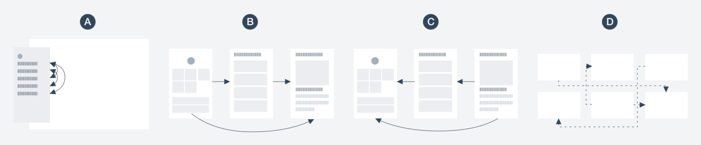
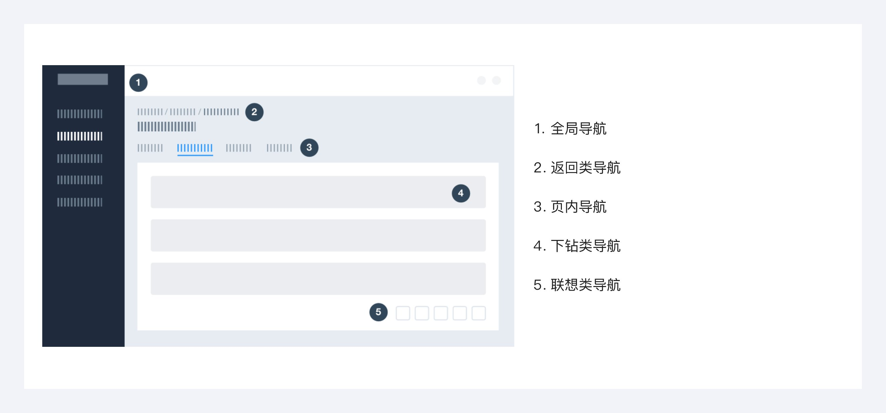

---
group:
  title: 组件用法
  order: 4
order: 2
title: 导航设计规则
toc: content
---

# 导航

导航用来展示当前产品中，用户在哪儿，可以去哪儿。

## 导航路径

导航路径可分为：

A-平移：同层级跳转

B-下钻：进入低层级的内容

C-返回 ：返回浏览历史或高低层级内容

D-联想导航：根据相关性导航至内容

## 导航类型

导航可划分为：全局导航、返回类导航、页内导航、下钻类导航、联想类导航。

全局导航包括：顶部导航菜单、侧边栏菜单、悬浮按钮菜单。

返回类导航包括：面包屑、返回按钮。

页内导航包括：页头、标签、树型控件、锚点、回到顶部。

下钻类导航：点击进入信息架构下层内容，默认站内跳转，站外新开标签页，典型场景为列表下钻至详情。

联想类导航：步骤条。

## 如何验证导航效果

验证导航系统的设计好坏可对其进行压力测试：像跳伞一样跳进网站里，验证导航系统的极限。

1）忽略首页，随机直达网站某一页面；

2）看用户是否能知道当前位置以及与网站其他部分的关系。在哪个网站的哪个部分？上层网页是什么？

3）是否知道这个网页会带你到哪里去？链接文字是否能说明去向?
