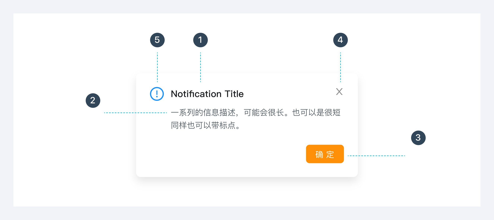
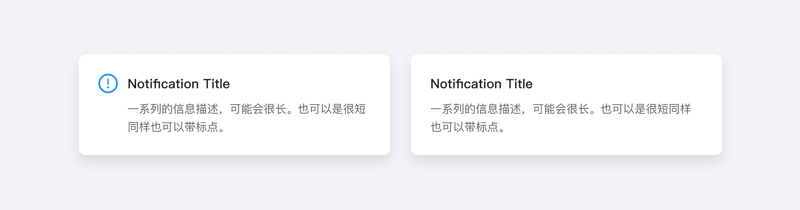
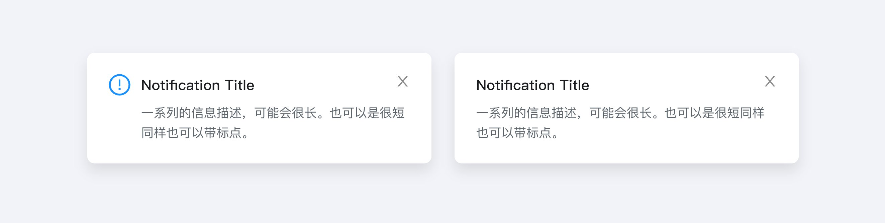
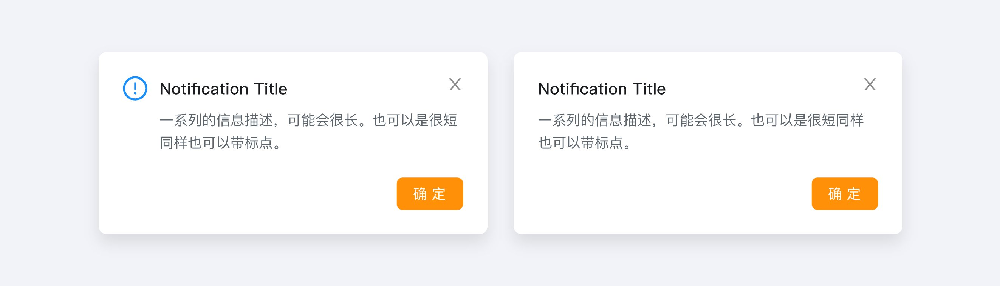
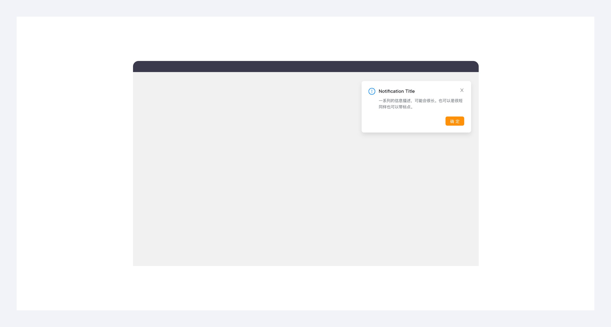

---
group:
  title: 组件用法
  order: 4
order: 10
title: 通知
toc: content
---

# 通知提醒 Notification

系统主动推送的重要的全局性通知信息，在系统右上角显示。

## 组件构成

1.标题（必有） ：传递核心信息，为用户提供通知的快速概览或直接结果。

2.通知文本（可选） ：用于描述额外的细节或可操作的步骤，通知的正文中可包含链接，这些链接可定向到后续步骤中。

3.行动按钮（可选） ：允许用户处理通知或将他们导航到包含更多详细信息的页面。

4.关闭按钮（可选） ：关闭通知提醒框。

5.图标（可选） ：辅助解释通知类型，让用户更快速、直观地理解信息

## 组件类型

普通信息

带关闭操作：用户可以自行选择关闭，也可由系统在延时后自动关闭。

需要用户处理： 用户需要点击行动按钮进行选择、确认才能进行。如果用户阅读通知或与通知交互很重要，则不应包含关闭按钮。

## 组件位置

位于页面右上角

