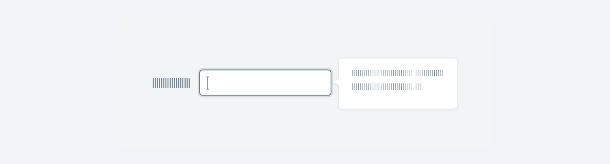

---
group:
  title: 组件用法
  order: 4
order: 11
title: 提示帮助
toc: content
---

# 气泡卡片 Popover

当目标元素有进一步的描述和相关操作时，可以收纳到卡片中，根据用户的操作行为进行展现。

## 文字提示 Tooltip

用于精确地描述被指向的对象，例如图标、图形、链接等，鼠标移入则显示提示，移出消失，不承载复杂文本和操作。

