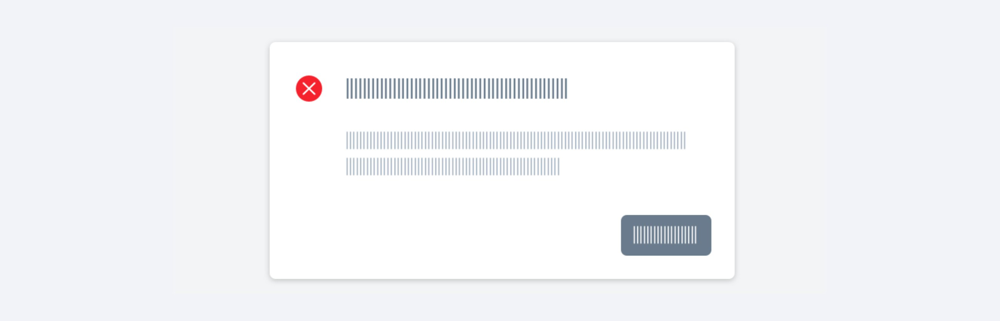

---
group:
  title: 组件用法
  order: 4
order: 14
title: 结果反馈
toc: content
---

# 结果反馈

## 顶部全局提示反馈（Message）

通过一个操作引发的反馈浮层位于顶部居中显示并自动消失，是一种不打断用户操作的轻量级提示方式。

由于反馈浮层的展示时长较短（默认 3s），对于比较重要的失败通知，建议改用对话框的形式通知，以避免用户遗漏信息。

## 对话框反馈

通过一个操作引发的反馈浮层位于页面中心，反馈内容可通过确认或取消按钮进行关闭，用户在反馈层出现时不可进行任何的操作，用于重要的反馈。 ｜注：除失败时避免显示不必要的提醒弹窗。弹窗是很强的反馈机制，只有在传递非常重要，且可操作的信息时才需要使用它。

