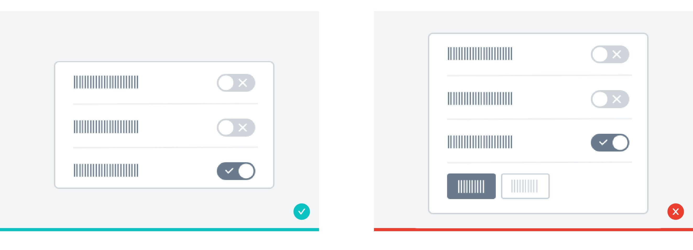
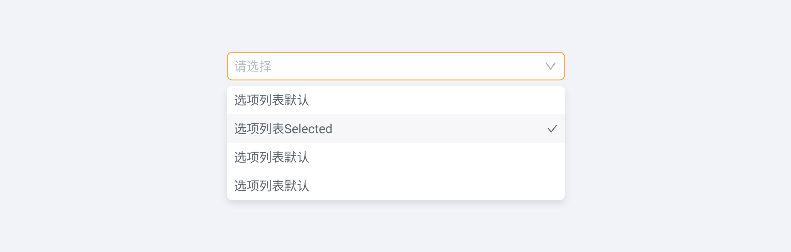
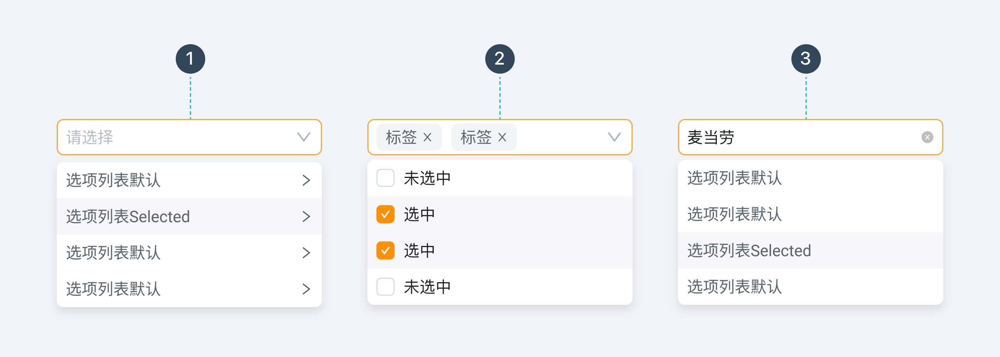
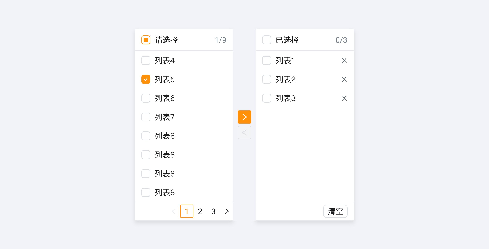

---
group:
  title: 组件用法
  order: 4
order: 16
title: 选择录入
toc: content
---

# 选择录入

## 单选框 Radio Button

单选框（Radio Button）一定多于 2 个，一般少于 5 个。

## 复选框 Checkbox

- 复选框（Checkbox）一般用于状态标记，需要和提交操作配合；

- 单个复选框可以表示两种状态之间的切换。

## 开关 Switch

- 用于切换单个选项的状态。「开关」的内联标签应该显示清楚，例如：禁用/启用，不允许/允许等。

- 当用户切换「开关」按钮将直接触发状态改变。

## 选择列表

- 选择列表（通常称为下拉菜单）允许用户从列表中选择一个选项或多个选项，为用户在选项的数量上提供了更多的灵活性。

- 当选项多于 5 项时使用；

- 列表选项按照逻辑排序，并尽量让内容显示完整。

在实际应用中，可在以上组件类型基础上对选择器的功能进行拓展，如 1.级联、2.多选标签、3.可清除。

## 滑块选择 Slider

滑块选择可以在连续或间断的区间内，通过滑动锚点来选择一个合适的数值。这种交互特性使得它在设置诸如音量，亮度，色彩饱和度等需要反映强度等级的选项时是一种极好的选择。

在不要求精准数值的场景下用户使用「连续滑块」可得到更灵活便捷的操作；在用户需要精确数值时，可与「数字输入框」搭配使用。

## 穿梭框 Transfer

两栏布局的多选组件，分为候选区和已选区，让用户以直观的方式将数据从一栏即时移到另一栏，完成选择或移除数据的交互行为。

