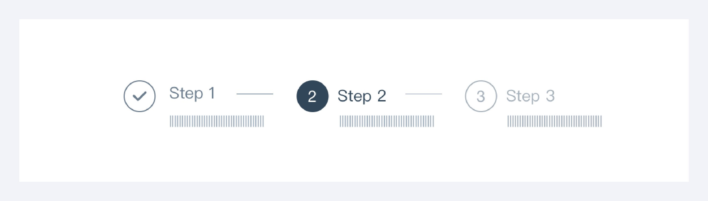
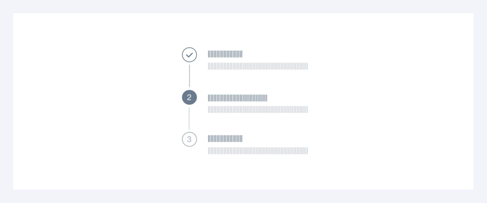

---
group:
  title: 组件用法
  order: 4
order: 6
title: 步骤条
toc: content
---

# 步骤条

步骤条是引导用户按照流程完成任务的导航条，可以帮助用户对操作流程长度和步骤有个预期，并且知道自己当前在哪个步骤，同时也可以对用户的任务完成度有明确的度量。当任务复杂或者存在先后关系时，将其分解成一系列步骤。

## 横向步骤条

步骤多于 2 步时使用，但建议不超过 5 步，每阶段文字长度保持在 12 个字符以内。

## 纵向步骤条

一般居页面左侧，悬浮固定，可追加多行文字描述，适合较多步骤或步骤数动态变化时使用，例如：时间步骤跟踪描述。

