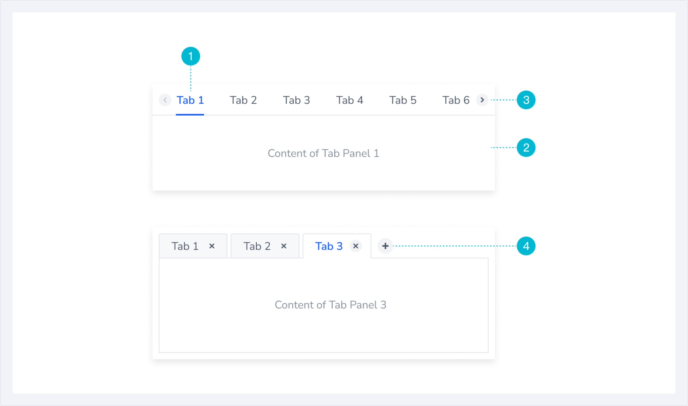
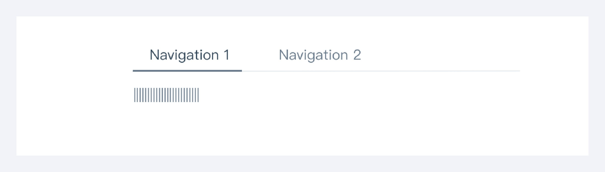
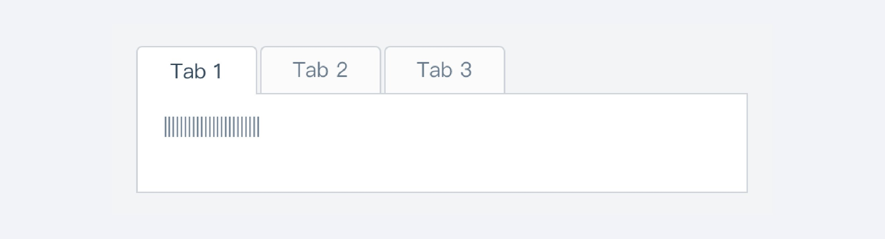
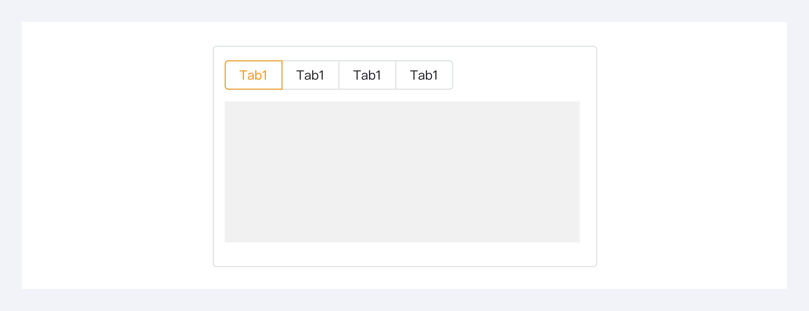

---
group:
  title: 组件用法
  order: 4
order: 5
title: 标签页
toc: content
---

# 标签页

标签页把大量信息进行分类展示，用户可以方便地切换标签，而不必跳转页面进行比较浏览，可以在有限的显示区域内展示更多信息。分类可根据业务类别、业务状态或者操作类型等并列关系来分，分类标题长度为 2-6 个中文字。

## 组件构成

1.标签（必有） ：简短的文字描述（必要时可附带图标），用于总结相应视图中的内容，同时作为切换视图的按钮，建议每个标签不超过4个汉字，一次展示不超过7个标签；

2.内容区域（必有） ：展示选中标签对应的内容，内容形式不限，区域大小根据内容量和页面布局而定；

3.滑动按钮（可选） ：当页面空间不足时，部分标签会出现溢出容器的情况，通过滑动按钮左右或上下滑动显示剩余标签；

4.新增&关闭按钮（可选） ：在支持定制标签页的场景下，可以通过新增和关闭按钮进行标签页的删减；

## 组件尺寸

标签页可根据使用场景选择合适尺寸，大尺寸常用于页头区，小尺寸常用在弹框等狭小的容器内。

标签的默认文字为14px，在页面空间不足的情况下可使用12px，同一组标签页的文字尺寸需要相同；

## 组件分类及使用场景

基本样式：引领整个页面的内容，用于主功能切换

卡片样式：用于页面中局部展示，包裹型容器能很好的和其它内容隔离。

胶囊型样式：用于卡片内的选项切换，经常和其它组件结合使用，让用户快速切换对应内容。

