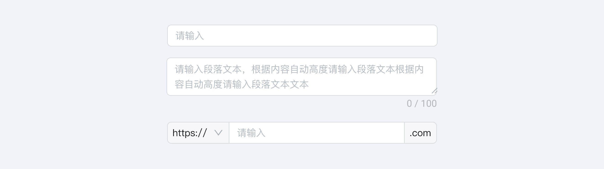

---
group:
  title: 组件用法
  order: 4
order: 15
title: 文本录入
toc: content
---

# 文本录入

## 文本框 Input

- 输入较少的字符总数，使用单行的输入形式。

- 录入长篇幅的单一的文本使用多行的文本区域。

- 在输入框前后添加的预置内容，常见标签有网址前后信息和计数单位。

## 提示与帮助

- 为提升数据录入效率，通常可以在输入框内增加暗提示以帮助提醒用户。

- 输入框通常与标签（label）搭配使用，标签（label）默认放于输入区域的左侧，当文案过长或英文环境下也可放于输入区域的上方，但在同系统中需保持统一。

当说明文案较长时，你可以使用一个「信息」图标或者提示工具。

## 搜索

搜索可以让用户在巨大的信息池中缩小目标范围，并快速获取需要的信息。

